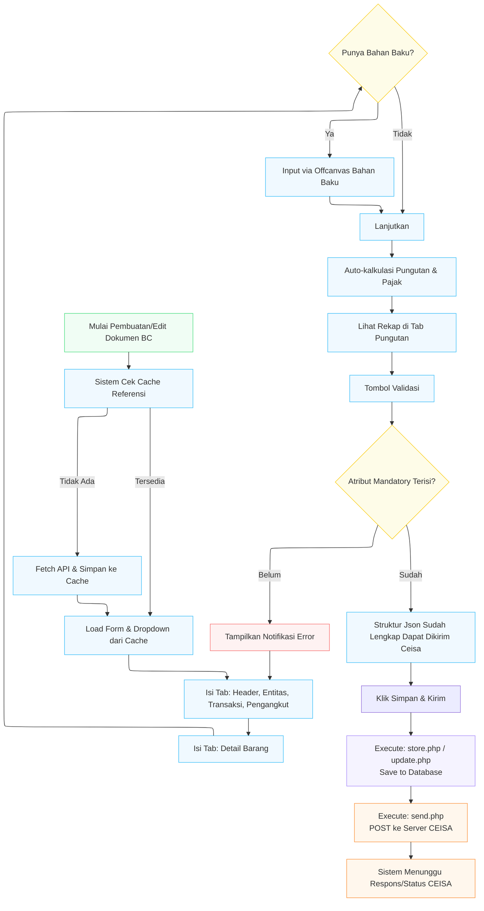

# EsikatCeisa - Sistem Integrasi Kepabeanan (TPB & PLB)

**EsikatCeisa** adalah aplikasi sistem integrasi berbasis web yang menjembatani dan mengotomatisasi proses pengelolaan dokumen kepabeanan untuk Tempat Penimbunan Berikat (TPB) dan Pusat Logistik Berikat (PLB). Fokus utama sistem ini adalah integrasi **Host-to-Host (H2H)** dengan sistem CEISA (Customs-Excise Information System and Automation) milik Direktorat Jenderal Bea dan Cukai (DJBC).

Aplikasi ini ditujukan untuk mempermudah perusahaan (Eksportir / Importir / Pusat Logistik Berikat) dalam melakukan perekaman, pengeditan, serta pengiriman dokumen pabean elektronik seperti BC 2.5, BC 2.7, dan BC 3.0.

---

## 🎯 Tujuan Pembuatan
1. **Efisiensi:** Mengurangi penginputan manual berulang dengan sistem *auto-populate* dari data master referensi Bea Cukai.
2. **Akurasi Pabean:** Meminimalisir *human-error* melalui fitur kalkulasi pungutan otomatis (Bea Masuk, PPN, PPh, dll) berdasarkan kurs, tarif, dan status/fasilitas barang (Dibayar, Dibebaskan, Ditangguhkan, dll).
3. **Kecepatan:** Memastikan Semua Program Dioptimasi Secepat Mungkin jika memilki banyak data perhari

---

## 💻 Tech Stack (Teknologi yang Digunakan)

### **Backend & Database**
- **Framework Utama**: [Laravel 13.8](https://laravel.com/) (menggunakan PHP 8.3+)
- **Database**: MariaDB / MySQL. 
  - *Catatan:* Proses akses data transaksi dan master CEISA menggunakan **PDO & Query Builder** secara langsung (tanpa Eloquent ORM) demi fleksibilitas kueri dan optimasi kecepatan pengolahan struktur dokumen yang masif.
- **PDF Generator**: `mpdf/mpdf` (digunakan saat mencetak draf/respon dokumen dari sistem CEISA).

### **Frontend & Styling**
- **UI & Styling**: 
  - **Blade Templates**: Dengan struktur modular *partials* (memecah UI kompleks menjadi komponen kecil).
  - **TailwindCSS (v3.4)**: *Utility-first framework* untuk antarmuka elegan, ringkas, dan responsif.
  - `@tailwindcss/forms`: Plugin untuk perapian elemen *form*.
- **JavaScript & Interaktivitas**:
  - **Vanilla JS & jQuery**: Menangani logika *client-side* (pengisian *state* otomatis antar-tab, kalkulasi nilai pajak secara *real-time*, AJAX API calls).
  - **Select2**: Untuk *dropdown* cerdas (sangat krusial untuk pencarian ribuan data referensi pelabuhan, valuta, dll).
  - **Feather Icons**: SVG icons *lightweight*.
  - **Notyf / SweetAlert2**: Untuk menampilkan pop-up interaktif & *toast notifications*.

---

## 🏗️ Struktur Arsitektur ("Procedural in Laravel")

Proyek ini mengadopsi pendekatan arsitektur spesifik: **"Procedural in Laravel"** pada modul CEISA. Hal ini berarti alur *request/routing* mengarah langsung ke eksekusi skrip `.php` fungsional di dalam direktori `app/Http/Controllers/Ceisa/` (seperti `store.php`, `update.php`, `get_detail.php`, `send.php`).

### Penjelasan Lengkap Alur Arsitektur & Berkas yang Terlibat:

1. **Routing & Render Tampilan (View Layer)**
   - Saat pengguna membuka sebuah form (misal: Pembuatan/Edit BC 2.7), rute Laravel akan mengembalikan *View* dari folder `resources/views/ceisa/tpb/bc27/form.blade.php`.
   - File `form.blade.php` ini bertindak sebagai kerangka utama. Di dalamnya, skrip melakukan *include* potongan-potongan UI yang disebut **Partials** dari folder `resources/views/ceisa/tpb/bc27/partials/` (seperti `form-header.blade.php`, `form-entitas.blade.php`, `form-barang.blade.php`, `form-pungutan.blade.php`, dan `offcanvas-bahan-baku.blade.php`).

2. **Pengambilan Data (Fetch Detail - Khusus Mode Edit)**
   - Jika dokumen sedang diedit, sistem akan mengeksekusi berkas **`app/Http/Controllers/Ceisa/TPB/BC27/get_detail.php`** (atau modul BC yang bersangkutan).
   - Skrip `get_detail.php` ini menggunakan PDO/Query Builder untuk melakukan *query* kompleks ke *database* MySQL guna menarik data dari tabel-tabel kepabeanan (seperti `rheader`, `rentitas`, `rbarang`, `rkemasan`, `rkontainer`, dll).
   - Seluruh data yang didapatkan tersebut disuntikkan (*injected*) ke dalam kerangka HTML menjadi variabel Javascript Global (misalnya: `window.bc27_header_data`, `window.bc27_barang`, `window.bc27_entitas`).

3. **Logika Client-Side & Interaktivitas UI (Javascript Layer)**
   - Peramban kemudian memuat berkas pusat kendali Javascript: **`public/js/bc27.js`** (untuk BC 2.7).
   - File JS inilah yang bertugas mengolah variabel *global* tadi untuk mengisi isian (input) di formulir secara otomatis.
   - Skrip ini juga berfungsi menarik **Data Referensi Master** (Valuta, Pelabuhan, Identitas) melalui API internal lalu menyimpannya ke memori peramban (`localStorage`) agar pilihan *dropdown Select2* termuat instan.
   - Di sini pula "Otak Kalkulasi" bekerja. Fungsi-fungsi matematika (menghitung nilai FOB, CIF, PDRI, distribusi fasilitas pembebasan) tereksekusi *real-time* di komputer klien tanpa harus me-*reload* halaman.

4. **Penyimpanan Draf ke Database (Store / Update Layer)**
   - Begitu pengguna mengeklik tombol "Simpan", fungsi di `bc27.js` mengemas keseluruhan data di formulir menjadi sebuah muatan data dan melakukan *request HTTP POST* (AJAX) ke *backend*.
   - Permintaan ini diproses oleh berkas **`app/Http/Controllers/Ceisa/TPB/BC27/update.php`** (jika mengedit) atau **`store.php`** (jika dokumen baru).
   - Skrip fungsional PHP ini membongkar kiriman tersebut, memetakannya, lalu melakukan operasi *INSERT / UPDATE* langsung ke tabel-tabel terkait di *database* (`rheader`, `rbarang`, `rbarang_bahan_baku`, dsb).

5. **Pengiriman Host-to-Host CEISA (API Gateway)**
   - Apabila instruksi yang dipilih adalah aksi submit ("Kirim Final" atau "Kirim Draft"), sistem memanggil berkas **`app/Http/Controllers/Ceisa/TPB/BC27/send.php`**.
   - Berkas `send.php` berfungsi sebagai gerbang/jembatan akhir. Skrip ini menarik seluruh draf di basis data, merekonstruksinya menjadi **Struktur JSON Payload v0.5.29** sesuai pakem H2H Bea Cukai, lalu menghasilkan/menyuntikkan Token Otorisasi.
   - Melalui cURL (*HTTP Request*), JSON dikirim ke Endpoint/API DJBC. 
   - Respons Bea Cukai direkam dalam basis data, di mana berkas pelengkap seperti **`status.php`** akan rutin dipanggil untuk memantau perubahan dokumen (misal: proses divalidasi, direject, atau disetujui).

---

## ✨ Kelebihan & Fitur Utama (Berdasarkan Modul BC)

Sistem EsikatCeisa didesain untuk memberikan fleksibilitas dan otomasi tingkat tinggi dengan sejumlah kelebihan utama berikut:

### 1. Smart Entity Reference (Referensi Entitas Langsung)
Pengguna tidak perlu lagi melakukan *input* entitas (Importir, Pemasok, Pemilik, dll) secara manual dari awal setiap kali membuat dokumen. Sistem telah menggunakan skema *referensi entitas* di mana identitas pihak yang terlibat langsung ditarik dan diisi ke dalam form sesuai dengan spesifikasi form (misalnya per BC 2.5 atau BC 2.7) sehingga menghemat waktu secara drastis.

### 2. Live JSON Inspector & Pemisahan Environtment
Sistem dilengkapi dengan fitur **Cek JSON** langsung dari antarmuka pengguna, yang amat mempermudah para *developer* untuk melihat secara utuh (*development debug*) *JSON payload* yang dikirimkan. Alur pengiriman API ini juga sudah secara rapi dipisah antara mode *Development* (Dev) dan *Production* (Live) melalui pengaturan di konfigurasi `.env`.

### 3. Penambahan HS Code Terintegrasi
Memudahkan operasional dengan kemampuan pencarian dan penambahan klasifikasi tarif dan pos tarif **HS Code** yang fleksibel secara langsung di dalam dokumen barang.

### 4. Ekosistem Terhubung (Integrasi EsikatERP)
Bagi perusahaan yang juga berlangganan produk **EsikatERP**, modul kepabeanan ini sudah dirancang agar dapat **terhubung langsung dengan sistem ERP tersebut**. Ini memberikan keuntungan masif karena sistem dapat dengan mudah melakukan penarikan data transaksi yang riil (*real-time*) langsung dari sistem **IT Inventory**, menyatukan data operasional dan pabean dalam satu alur yang utuh.

---

## 🔄 Flowchart Aplikasi (Alur Kerja Pengguna)



---

## 🔮 Future Development: Arsitektur Multi-Database (Multi-Tenant)
Ke depannya, aplikasi ini dirancang untuk beralih menggunakan **Arsitektur Multi-Database**. Rencana pembaruan ini meliputi:
- **Database Mandiri per Klien:** Setiap klien (perusahaan) yang berlangganan akan memiliki *database* (skema) mereka masing-masing secara terpisah.
- **Keamanan & Isolasi Data Maksimal:** Mencegah tercampurnya data transaksi kepabeanan (dokumen BC, HS Code, Entitas) antarklien, sehingga privasi dan integritas data terjamin.
- **Skalabilitas & Performa:** Memudahkan proses pencadangan (*backup*), pemulihan (*restore*), serta menjaga *query* tetap ringan karena volume data di satu *database* dibatasi hanya untuk satu entitas klien.
---

## 🚀 Instalasi & Development

Jalankan perintah berikut untuk mengoperasikan aplikasi dalam mode *development*:

```bash
# Menjalankan Backend Laravel Server
php artisan serve

# Kompilasi Aset Frontend (Tailwind & JavaScript)
npm run dev
```

*Dokumen ini merupakan pedoman arsitektur sistem EsikatCeisa (TPB/PLB) agar para developer memahami struktur "Procedural in Laravel" dan konsep flow H2H CEISA di dalamnya.*
